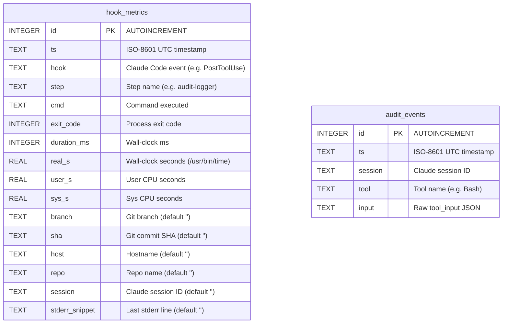

# Database ERD — hooks.db

## Indexes

| Table | Index | Columns | Condition |
|-------|-------|---------|-----------|
| `hook_metrics` | `idx_hm_ts` | `ts` | — |
| `hook_metrics` | `idx_hm_hook_step` | `hook, step` | — |
| `hook_metrics` | `idx_hm_exit` | `exit_code` | `exit_code <> 0` |
| `hook_metrics` | `idx_hook_metrics_session` | `session` | `session != ''` |
| `audit_events` | `idx_ae_ts` | `ts` | — |
| `audit_events` | `idx_ae_session` | `session` | — |
| `audit_events` | `idx_ae_tool` | `tool` | — |

## Notes

- `hook_metrics.session` and `audit_events.session` are the join key for correlating tool calls with hook executions within a Claude Code session.
- `hook_metrics.exit_code = 1` on steps in `SEMANTIC_EXIT_STEPS` (e.g. `codex-review`) indicates findings, not failure.
- Rows older than 30 days are pruned probabilistically (~1% of writes) via `_maybe_prune_hooks_db` in `db-init.sh`.
- Schema migrations are additive (`ALTER TABLE`) and idempotent via `_init_hooks_db`.
